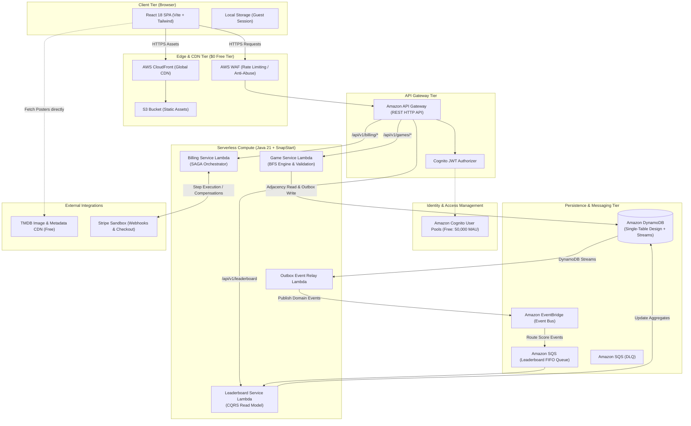
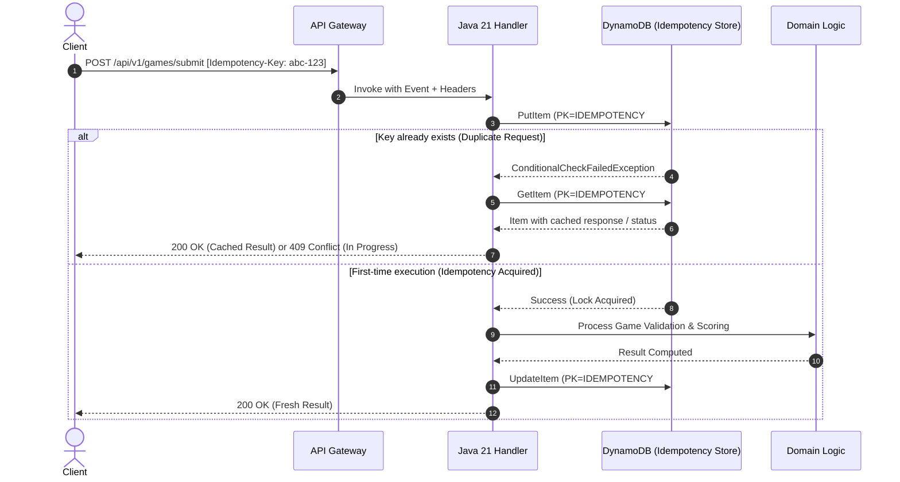
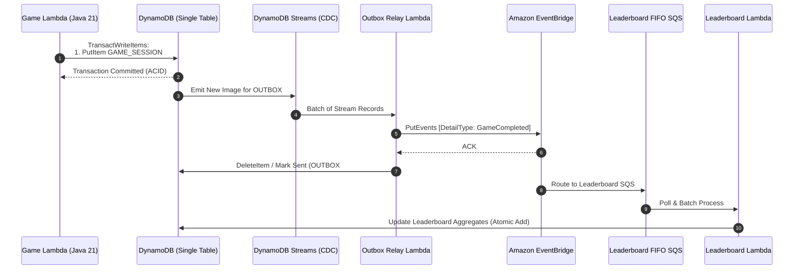
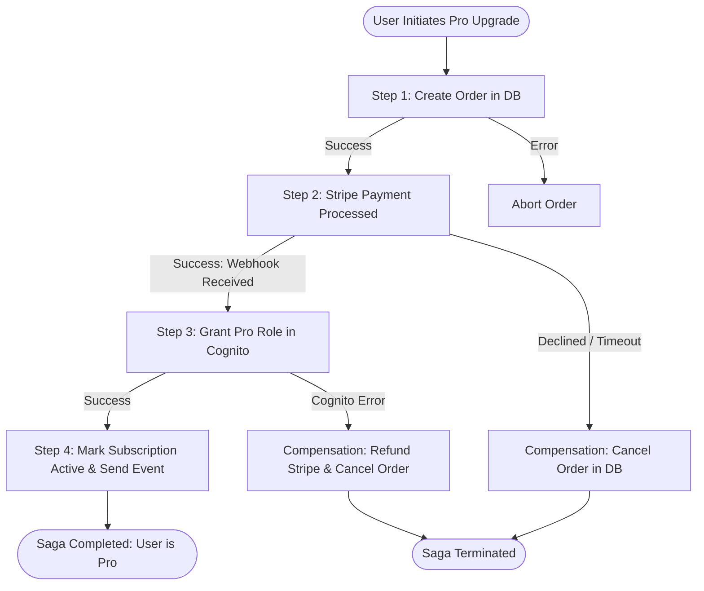

# ReelQuest — Enterprise System Design Blueprint
**Platform:** Serverless Movie Gaming Hub  
**Author:** Lead Software Architect & Principal Engineer  
**Target Environment:** AWS ($0 Free Tier Budget)  
**Backend Stack:** Java 21, Serverless (SnapStart), DynamoDB, EventBridge, SQS, Cognito  
**Frontend Stack:** React (Vite), Tailwind CSS, React Flow / D3.js, CloudFront + S3  


---

## 1. Executive Summary & Architecture Overview

ReelQuest is a high-throughput, latency-optimized movie gaming platform built on a cloud-native, event-driven serverless architecture. The platform demonstrates enterprise-grade distributed systems patterns: **Idempotent API processing**, **Transactional Outbox**, **SAGA distributed transaction orchestration**, **Eventual Consistency via CQRS**, and **Graph shortest-path traversal (Bidirectional BFS)**.

### 1.1 High-Level Architecture (C4 Level 2 Container Diagram)



---

## 2. Core Distributed System Patterns

### 2.1 Distributed Idempotency Engine
In distributed gaming and billing, duplicate submissions (network retries, double-clicks) can compromise leaderboard integrity and cause double-billing.

#### Architecture:
* **Client Contract:** Every state-mutating request (`POST /api/v1/games/submit`, `POST /api/v1/billing/checkout`) requires an `Idempotency-Key: <UUIDv4>` header.
* **Storage:** DynamoDB conditional write using `attribute_not_exists(PK)`.
* **TTL:** Keys expire after 24 hours automatically at zero cost.



---

### 2.2 Transactional Outbox Pattern
Ensures dual-write consistency between the primary database update (saving game score) and event dispatching (updating leaderboards, awarding badges) without distributed 2PC transactions.

#### Mechanism:
1. **Atomic Transaction (`TransactWriteItems`):** The Game Lambda atomically writes both the **Game Session Record** and an **Outbox Event Record** into DynamoDB in a single ACID transaction.
2. **Change Data Capture (CDC):** DynamoDB Streams captures the newly inserted Outbox record.
3. **Outbox Relay Lambda:** Triggers on stream insertion, extracts the payload, and dispatches to **Amazon EventBridge**.
4. **Consumer Decoupling:** EventBridge filters and routes events to target SQS queues (e.g., `Leaderboard-Queue`, `Achievement-Queue`).



---

### 2.3 SAGA Pattern (Billing & Subscription Orchestration)
Handles distributed transactions for Freemium subscription purchases and upgrades. We implement a **Choreography/Orchestration Hybrid** using compensations.

#### SAGA Steps & Compensations:

| Step # | Action | Success State | Failure Compensation |
| :--- | :--- | :--- | :--- |
| **1. Create Order** | Record pending subscription in DynamoDB | `SUBSCRIPTION_PENDING` | Mark order `CANCELLED` |
| **2. Payment Authorization** | Call Stripe Sandbox API (`/v1/checkout/sessions`) | `PAYMENT_AUTHORIZED` | Issue Stripe Refund / Void authorization |
| **3. Entitlement Provision** | Add User to `ProUsers` group in AWS Cognito | `ROLE_GRANTED` | Remove User from Cognito `ProUsers` group |
| **4. Finalize Subscription** | Update DynamoDB record to active status | `ACTIVE` | Revert to `FREE_TIER` status |



---

## 3. Data Architecture: DynamoDB Single-Table Design

Single-Table design minimizes costs, provides single-digit millisecond latency, and fits within the 25 GB free tier.

### 3.1 Primary Key & Indexing Architecture

* **Primary Key:** `PK` (Partition Key, String), `SK` (Sort Key, String)
* **Global Secondary Index 1 (GSI-1):** `GSI1PK`, `GSI1SK` (For reverse lookups and leaderboards)
* **Time-to-Live (TTL):** Attribute `ExpiresAt` (Epoch seconds)

### 3.2 Single-Table Entity Mapping Table

| Entity Type | PK (Partition Key) | SK (Sort Key) | GSI1PK | GSI1SK | Attributes |
| :--- | :--- | :--- | :--- | :--- | :--- |
| **Actor Node** | `ACTOR#<actor_id>` | `METADATA` | `NAME#<actor_name>` | `POPULARITY#<score>` | `name, tmdb_id, profile_path, popularity` |
| **Movie Node** | `MOVIE#<movie_id>` | `METADATA` | `TITLE#<movie_title>`| `YEAR#<release_year>` | `title, year, poster_path, rating, vote_count` |
| **Graph Edge (Actor->Movie)** | `ACTOR#<actor_id>` | `MOVIE#<movie_id>` | `MOVIE#<movie_id>` | `ACTOR#<actor_id>` | `character_name, billing_order` |
| **User Profile** | `USER#<cognito_sub>` | `PROFILE` | `EMAIL#<email>` | `STATUS#<tier>` | `username, tier (FREE/PRO), created_at` |
| **Daily Game Session** | `USER#<user_id>` | `SESSION#<date>#<id>` | `GAME#<date>` | `SCORE#<moves_count>` | `start_actor, end_actor, path, duration_ms, moves` |
| **Daily Leaderboard** | `LEADERBOARD#<date>` | `RANK#<rank_score>` | `USER#<user_id>` | `SCORE#<score>` | `username, avatar, moves_count, duration_ms` |
| **Transactional Outbox** | `OUTBOX#<event_id>` | `TIMESTAMP#<iso>` | `STATUS#PENDING` | `TIMESTAMP#<iso>` | `event_type, payload_json, retry_count` |
| **Idempotency Key** | `IDEMPOTENCY#<key>` | `LOCK` | - | - | `status (IN_PROGRESS/COMPLETED), response_hash, ttl` |

---

## 4. Graph Algorithm: Bidirectional Breadth-First Search (BFS)

### 4.1 Theoretical Advantage
Standard BFS explores radially from Actor $A$ to Actor $B$. If branching factor is $b \approx 25$ (average co-stars per movie) and distance is $d = 4$:
$$\text{Standard BFS Search Space} = O(b^d) = 25^4 \approx \mathbf{390,625 \text{ nodes}}$$

With **Bidirectional BFS**, searches simultaneously expand from $A$ and $B$, meeting in the middle:
$$\text{Bidirectional BFS Search Space} = O(2 \cdot b^{d/2}) = 2 \cdot 25^2 \approx \mathbf{1,250 \text{ nodes}}$$
**Improvement: >99.6% reduction in state space and query latency!**

### 4.2 In-Memory Hot Cache & Subgraph Storage
* **Curated Subgraph:** Top 30,000 films and ~70,000 actors.
* **Storage representation:** Adjacency List stored in DynamoDB for cold queries.
* **Lambda Level-1 Cache:** High-degree hub actors (e.g., Samuel L. Jackson, Kevin Bacon, Willem Dafoe) are cached in the Java Lambda heap memory across warm invocations.

---

## 5. AWS Free Tier FinOps Verification ($0 Target)

| AWS Service | Free Tier Monthly Allowance | ReelQuest Projected Consumption | Monthly Cost |
| :--- | :--- | :--- | :--- |
| **AWS Lambda** | 1,000,000 free requests + 3.2M sec compute | ~150,000 requests (SnapStart enabled) | **$0.00** |
| **Amazon DynamoDB** | 25 GB Storage + 25 WCU / 25 RCU | ~250 MB storage + Pay-Per-Request Free Tier | **$0.00** |
| **Amazon S3** | 5 GB Standard Storage + 20,000 GETs | < 50 MB (Vite SPA static build) | **$0.00** |
| **Amazon CloudFront** | 1 TB Data Transfer Out + 10M requests | ~2 GB transfer out | **$0.00** |
| **Amazon Cognito** | 50,000 Monthly Active Users (MAUs) | < 2,000 MAUs | **$0.00** |
| **Amazon EventBridge** | 1,000,000 custom events / month | ~50,000 events | **$0.00** |
| **Amazon SQS** | 1,000,000 standard requests / month | ~100,000 queue actions | **$0.00** |
| **Total Projected Cost** | - | - | **$0.00 / month** |

---

## 6. Implementation Milestones

```
Phase 1: Architecture Blueprint & Visual Concept Validation  [CURRENT]
Phase 2: Project Monorepo Setup & Infrastructure as Code (Terraform / AWS CDK)
Phase 3: Movie Graph Data ETL Pipeline (Top 30K Movies & Actors DynamoDB Seeder)
Phase 4: Java 21 Core Backend (Bidirectional BFS, SnapStart, Idempotency & Outbox)
Phase 5: React Frontend + Visual Graph Engine (Tailwind, React Flow, Audio/Visual FX)
Phase 6: Auth (Cognito), Stripe SAGA, Leaderboards & Production Deploy
```
